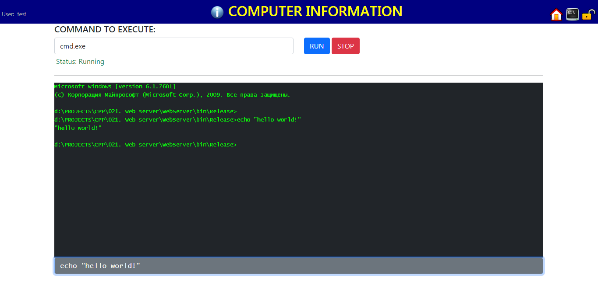

# MULTITHREADED WEB (HTTP) SERVER WITH TEMPLATE PARSER AND USER'S SESSION SUPPORT ON C#

[Russian version](README.md)

<!---->

## 1. INTRODUCTION

Here is a simple HTTP-server with [template paserer](#5-templateparser-class) based on slightly modified Jinja language syntax with [user's session support](#43-using-a-user-session) on the server side. It intends for usage in small C# projects where the HTTP based interfaces is needed. Configuring the server is very simple and requires to set only a handful of parameters in the following classes:

- [WebServerV1](#2-webserverv1-class)
- [RouteFunctions](#3-routefunctions-class)

**WebServerV1** - this class is a heart of the system and contains all necessary methods for multithreaded processing and maintain the sessions. It uses a Route Table linked with **RouteFunctions** static methods to process HTTP requests.

**RouteFunctions** - the class is a "working horse", it contains all user-defined methods to process HTTP requests.

## 2. WebServerV1 CLASS

The base class to run the web server. Listens to all incoming connections on 8080 port by default ("http://localhost:8080" prefix).

In case the web server is used to accept requests on any of network interfaces, the following configuration is required:

- initialize the server with prefix `prefix="http://+:8080/"`
- add permission in the Windows command line `netsh http add urlacl url=http://+:8080/`

Remark: to see current network permission use: `netsh http show urlacl`. To remove permission use: `netsh http delete urlacl url=http://+:8080/`

> ATTENTION: This web server does not control hanged processing threads as well as does not control the number of running threads.

### 2.1. PROPERTIES

Name | Type | Description
---- | ---- | -----------
responseCodePage | string | The code page name of the returned string `ResponseContext.responseString` by the user's route function. The default value is "UTF-8". For Cyrillic from Visual Studio code (in the case when the `TemplateParser.ParseFromString` function is used) it should be "windows-1251".
staticContent | string | Specifies the location of static content if it is external, i.e. pictures, css files, etc. if they are stored in files, and are not an embedded resource (EmbeddedResource). Supports relative paths like (".. \\ .. \\"). The default value is the current directory.
useEmbeddedResources | bool | Shows where to get the static files. If set to True, then for all file requests (except for HTML pages that are processed in route functions, where the path to templates is directly specified) objects will be searched in Embedded Resources. If False, then files are searched in the staticContent directory. The default value is False.

### 2.2. METHODS

Full declaration | Description
---------------- | --------
void WebServerV1(string prefix = "http://localhost:8080/") | Constructor. Launches a web server to listen and process requests. The Prefix is the prefix for the HttpListener class.
void Stop() | Shuts down the server gracefully. It is possible to terminate the program without calling this method.
public void AddRoute(string route, RouteFunction function) | Adds a route function to the route table.

## 3. RouteFunctions CLASS

Static class containing static methods executed if the requested address matches the specified route in the routing table of the **WebServerV1** class. The class and its methods can be dynamic, but then it must be initialized before adding the methods to the routing table.

All methods of the class must meet to the definition of the delegate `public delegate ResponseContext RouteFunction (RequestContext context)` of the **WebServerV1** class.

### 3.1. REQUEST CONTEXT

The variable **context** of the **SessionData** class containing the context of the request is passed to the route function for handling the request from the client. The properties and methods of this variable are given below:

Property Name | Type | Description
------------- | ---- | --------
Method | RequestMethod | Enumeration. Contains the HTTP request method.
Route | string | The requested URL starts with "/". For example: "/" = "http://localhost:8080", "/login" = "http://localhost:8080/login" etc.
parameters | Dictionary<string, string> | Dictionary pairs of the HTTP request.
templateVariables | Dictionary<string, object> | A pre-built dictionary for the HTML template. Contains a **SessionData** object named 'session' by default. You can use your dictionaries to pass variables to the **TemplateParser** template engine.
session | SessionData | Direct reference to the user session object of the **SessionData** type. Direct use is not recommended. To manage sessions, you must use the methods of the **SessionManager** class.
sessionManager | SessionManager | A reference to the **SessionManager** class to manage the user session.
baseRequest | HttpListenerRequest | Reference to the original **HttpListenerRequest** class to get for more request parameters.

Full declaration code | Description
--------------------- | -----------
public string GetParam(string name, string defaultValue = "") | Returns the value of the parameter received via GET / POST. This method is preferable than direct access to the values dictionary.
public int GetParamsCount() | Returns the number of HTTP parameters in the request.

### 3.2. RESPONSE CONTEXT

The route function must return an object of class **ResponseContext** declared as `public ResponseContext (string responseString =" ", string redirectUrl =" ", HttpStatusCode exitCode = HttpStatusCode.OK)`, where:

- **responseString** - HTML string to respond to the client. It can be either in the form of plain text (for example, for responses in XML or JSON format), or in the form of a preprocessed template via the **TemplateParser** template engine.
- **redirectUrl** - redirect string. By default it equals to an empty string and can be omitted in response. If it is not equal to an empty string, then it triggers a server response telling the client that the resource has been moved and it is necessary to go to another page. This kind of the redirect uses the client to redirect to another page or web resource. If you need to use the execution of another route function from processing one, then it must be called directly from the code. At the same time, do not forget that if a Request object from the original function is passed to another route function, then it will contain all the parameters of the current request. If the parameters are changed, they must be manually altered through the **parameters** property of the **SessionData** object.
- **exitCode** - server response code to the client. The default is 200 - OK. May be omitted.

## 4. EXAMPLES

### 4.1. Creating a server and a test page

```C#
static void Main(string[] args)
    {
        WebServerV1 www = new WebServerV1();
        www.AddRoute("/", RouteFunctions.Index);

        Console.WriteLine("Press a key to exit");
        Console.ReadKey(true);

        www.Stop();
    }

...

static class RouteFunctions
{
    // Route: "/"
    public static ResponseContext Index(RequestContext context)
    {
        context.variables.Add("dateNow", DateTime.Now);

        TemplateParser tp = new TemplateParser();
        
        return new ResponseContext(tp.ParseFromString(@"<HTML><BODY>Today is {{ dateNow }}</BODY></HTML>", context.variables));
    }
}

```

### 4.2. Retrieving data from a web page

```HTML
<form method="POST" action="/person">
  <input name="username">
  <button type="submit">
</form>

<form method="GET" action="/person">
  <input name="gender">
  <button type="submit">
</form>
```

```C#
static class RouteFunctions
{
    // Route: "/person"
    public static ResponseContext Person(RequestContext context)
    {
        string login;
        string gender;

        if (context.Method == RequestMethod.POST)
        {
            if ((login = context.GetParam("login")) != "")
            {
                // some code here
            }
        }

        if (context.Method == RequestMethod.GET)
        {
            if ((gender = context.GetParam("gender")) != "")
            {
                // some code here
            }
        }
    }
}
```

### 4.3. Using a user session

```C#
// Route: "/logon"
public static ResponseContext Logon(RequestContext context)
{
    if (context.GetParam("login") == "test" && context.GetParam("password") == "1")
    {
        // session is created automatically as soon as there is at least one key.
        // the session exists until the web browser are running by default.
        context.sessionManager.SessionSetKey(ref context.session, "user", "test");

        // you can manually set the session time. here - 24 hours.
        context.session.expiration = 60*24;
    }
}

// Route: "/logout"
public static ResponseContext Logout(RequestContext context)
{
    context.sessionManager.SessionClear(ref context.session);
}

// Route: "/page1"
public static ResponseContext Page1(RequestContext context)
{
    // check access
    if (context.sessionManager.SessionGetKey(context.session, "user") == null)
    {
        // user is not logged in - redirect to the main page
        return new ResponseContext("", "/");
    }

    // any type of objects can be stored in the session
    List<int> list = context.sessionManager.SessionGetKey(context.session, "list", new List<int>());
    list.Add(10);
    context.sessionManager.SessionSetKey(ref context.session, "list", list);
}
```

### 4.4. Page redirection and http error templates

```C#
// this line will return an empty response to the client's browser with a redirect
// in the Header to the "newpage" page
return new ResponseContext("", "/newpage");

// this line will return a text message to the client and set the return code to 404.
// an existed template can be used as an answer.
return new ResponseContext("Page is not found", "", HttpStatusCode.NotFound);
```

## 5. TemplateParser CLASS

Template generator class. Parses an input pattern passed either as a string or file.
During the development of the class, the Jinja language was taken as a basis.

### 5.1. METHODS

Full declaration code | Description
--------------------- | -----------
string ParseFromString(string template, Dictionary<string, object> data = null, Encoding fileEncoding = null) | Returns the parsed text of the template from a string.
string ParseFromFile(string filename, Dictionary<string, object> data = null, Encoding encoding = null) | Returns the parsed text of the template from a file.
string ParseFromResource(string resource, Dictionary<string, object> data = null) | Returns the parsed text of the template from an embedded resource of assembly.

### 5.2. LANGUAGE OF TEMPLATES

The template language consists of *variables* and *commands*. The first are specified through double curly braces `{{ <variable name> }}`, the second through a combination of double brackets and percent sign ``. The syntax for the template language control code is as follows:

[opening escape sequence `{{` or ``]

#### 5.2.1. SPACE CONTROL SPECIFICATORS

Space control specifiers can be added to the escape sequence as needed.

`-` (minus). Trim all spaces and line breaks '\r\n' from the left or right of the escape sequence. For example: `{{- x }}` - remove from the left, `{{ x -}}` - remove from the right, `{{- x -}}` - remove from both sides.

#### 5.2.2. VARIABLES AND EXPRESSIONS

Variables can be passed from an external dictionary or created inside the {{}} block, in the last case they will be variables in the internal dictionary. The template engine uses two types of variable dictionary: external and internal. The external dictionary is optionally passed when creating the **TemplateParser** class or calling **ParseFrom** methods. The internal dictionary is used when values is assigned ​​to variables as a result of executing code in the {{}} tags or when creating a loop variable. In the process of searching for a variable in dictionaries, the variable is first searched for in the internal dictionary, then in the external one.

```JINJA
VARIABLES:
{{ login }} -- will display the variable 'login' from the external dictionary if the external dictionary contains the definition of 'login'.
{{ x=10 }} -- will display nothing but will create if it did not exist and assign the internal variable "x" the value 10.
{{ arr[0] }} -- will return the value at index zero from the array. If the array does not exist, it will return null. If the index is out of range, it will return an error.
{{ dict['keyname'] }} -- will return the value from the dictionary with the key 'keyname'. If the dictionary does not exist or the key value does not exist, it will return null.
{{ class.property }} -- will return the value of the 'property' field from the class 'class'. If the class does not exist, it will return null. If the field does not exist, it will return an error.
{{ class.property.array[4].field }} -- support for complex variables.

CONSTANTS:
{{ 20 }} {{ 'hello' }} -- will display constants 20 and 'hello' (without quotes). NOTE: all strings must be in single quotes.
{{ ''hello'' }} -- will display 'hello' (in quotes).

EXPRESSIONS:
{{ (-1 * (45+18)/2 + (4^3)- 18 / (3 * 4)) / -256.5 }} -- will calculate and output the result -0.1208577.
{{ x + 30 }} -- will calculate the value of the variable "x" and perform the addition. The result is 40 if x = 10.
{{ 'hello' + ' ' + 'world!' }} -- will perform string concatenation. The result is 'hello world!' without quotes.
{{ 'x= ' + x }} -- will calculate the value "x" and concatenate with the string. The result is "x = 10" if x = 10.
{{ y = x }} -- will assign to variable "y" the value of variable "x".
{{ z = true }} -- set the value of the variable "z" to true. NOTE: Supported keywords are 'true', 'false', 'null'.
```

The following operators are supported in expressions: ^ (exponentiation), * (multiplication), / (division), + (addition), - (subtraction),% (modulo), () (parentheses to increase the priority of operations).

>*Note. When adding numbers and strings, a situation may arise where the numbers are not calculated properly. For example, in the expression {{'x =' + x + x}}, the output will be "x = 1010", not "x = 20". This is because the calculation process goes from left to right, if the first operand is text, then the second will be added in the string concatenation mode, and not as a result of arithmetic. In order for the arithmetic action to be performed first, the priority of the operations must be increased using parentheses. Thus, to get "x = 20", you need to call the expression {{'x =' + (x + x)}}*.

#### 5.3. COMMANDS

All commands are case sensitive and written in capital letters.

##### 5.3.1. CONDITIONS

*Syntax:*

```JINJA2

block of code if condition is true

block of code if condition is not true

```

Logical operands: `&&` (logical AND), `||` (logical OR), `!` (logical NOT), `<` (less than), `<=` (less than or equal), `>` (greater than), `>=` (greater than or equal), `==` (equal), `!=` (not equal).

>*Note. Values are not automatically cast to boolean expressions, except for boolean values. Therefore, one of the comparison operands must be used. For example: {{x = 1}} {{y = true}}  <- will cause an error,  <- there will be no error.*

*Examples:*

```JINJA2


```

##### 5.3.2. LOOPS

*Syntax:*

```JINJA

output block


```

Loops can be either enumerated over numbers or over collections with type **IEnumerable**.

>*Note. After exiting the loop, the loop variable is available in the internal dictionary with the last value.*

*Examples:*

```JINJA2
 -- will iterate over all `row` values in an array or list or dictionary `rows`.
 -- will iterate over numbers from 1 to 4 in increments of 1.
 -- will iterate over the numbers from 1 to the value in the variable "x" in increments of 2.
 -- perform an abnormal exit from the loop if the "x" value is 4.
 -- unconditional interruption of the cycle.
```

#### 5.4. EXAMPLE

```C#
// create a dictionary with data
Dictionary<string, object> data = new Dictionary<string, object>()
{
    { "year", 2020 },
    { "text", "Hello world!" },
};
````

```HTML
// template
<!DOCTYPE html>
<html>
    <head>
    <meta charset="UTF-8">
        <style>
            .bluetext {
                color: blue;
            }
            .redtext {
                color: red;
            }
        </style>
    </head>
    <body>
        {{ rows = 5 }}
        
            <p class=""{% IF i % 2 == 0 %}bluetextredtext"">
            {{  i + '  &copy;' + year + '. ' + text }}
            </p>
        
    </body>
</html>
```

## 6. EXAMPLE OF USE

As an example of the full-fledged use of a web server, this project includes the functionality of obtaining basic data about a computer based on WMI queries, as well as launching and managing the CMD.EXE command line through the web interface. You must be authorized to access the remote command line. The system uses either the login and password of any of the existing users on the local computer, or you can use the built-in user "test" with the password "1".




<!---->
