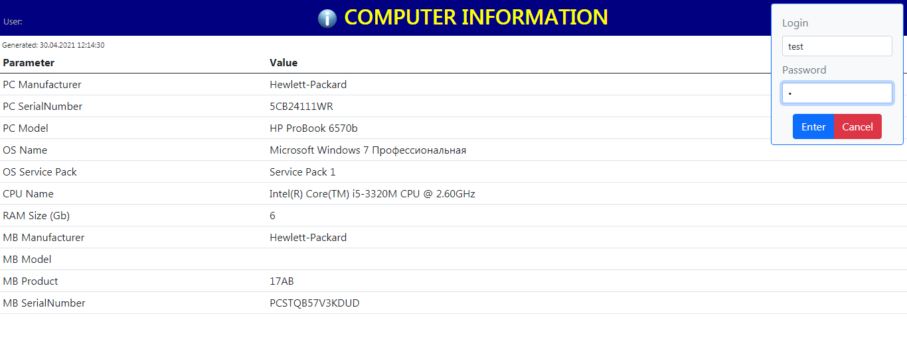

# МНОГОПОТОЧНЫЙ ВЕБ (HTTP) СЕРВЕР С ШАБЛОНИЗАТОРОМ И ПОДДЕРЖКОЙ ПОЛЬЗОВАТЕЛЬСКИХ СЕССИЙ НА C#

[English version](README.en-US.md)

<!---->

## ВВЕДЕНИЕ

Простой многопоточный сервер с поддержкой [пользовательских сессий](#Использование-пользовательской-сессии) и встроенным [шаблонизатором](#КЛАСС-TemplateParser) по принципу Jinja для использования в проектах C#, где необходим веб-интерфейс.

Работа сервера строится на настройке двух классов:

- [WebServerV1](#КЛАСС-WebServerV1)
- [RouteFunctions](#КЛАСС-RouteFunctions)

**WebServerV1** - класс содержащий все необходимые действия по многопоточной обработке запросов на базе таблицы маршрутизации и обслуживанию сессий.

**RouteFunctions** - статический класс содержащий методы которые будет вызывать таблица маршрутизации.

## КЛАСС WebServerV1

Основной класс для запуска веб сервера. По умолчанию обрабатывает входящие локальные запросы на 8080 порту (префикс "http://localhost:8080").

В случае использования в качестве удаленного сервера принимающего запросы на любом интерфейсе необходимо следующее:

- инициализировать сервер с параметром `prefix="http://+:8080/"`
- добавить разрешение через командную строку: `netsh http add urlacl url=http://+:8080/`

Примечание: просмотр текущих сетевых разрешений: `netsh http show urlacl`. Удаление разрешения: `netsh http delete urlacl url=http://+:8080/`

> Важно! В веб сервере не реализован механизм контроля зависших потоков выполнения, а так же нет ограничений на количество запущенных потоков.

### СВОЙСТВА

Имя свойства | Тип | Описание
------------ | --- | --------
responseCodePage | string | Имя кодовой страницы возвращаемой строки `ResponseContext.responseString` пользовательской функцией. По умолчанию "UTF-8". Для кириллицы из кода Visual Studio (в случае когда используется функция `TemplateParser.ParseFromString`) должна быть "windows-1251".
staticContent | string | Задает место расположения статического контента, в случае если он является внешним, т.е. картинки, файлы css и т.п хранятся в файлах, а не являются встроенным ресурсом (EmbeddedResource). Поддерживает относительные пути вида ("..\\..\\"). Значение по умолчанию - текущая директория.
useEmbeddedResources | bool | Показывает откуда брать статические файлы. Если установлен в True, то на все запросы файлов (кроме HTML страниц, которые обрарабатываются в route-функциях, где напрямую указывается путь к шаблонам) объекты будут искаться в Embedded Resources. Если False, то файлы ищутся в директории staticContent. По умолчанию равен False.

### МЕТОДЫ

Полный код объявления | Описание
--------------------- | --------
void WebServerV1(string prefix = "http://localhost:8080/") | Конструктор. Запускает веб сервер на прослушивание и обработку запросов. Префикс является префиксом класса HttpListener.
void Stop() | Корректно завершает работу сервера. Можно завершать программу без вызова данного метода.
public void AddRoute(string route, RouteFunction function) | Добавляет маршрут перехода в таблицу маршрутов.

## КЛАСС RouteFunctions

Статический класс содержащий статические методы выполняемые, если запрошенный адрес совпадает с указанным маршрутом в таблице маршрутизации класса **WebServerV1**. Класс и его методы могут быть динамическими, но тогда он должен быть инициализирован до добавления методов в таблицу маршрутизации.

Все методы класса должны соответствовать определению делегата `public delegate ResponseContext RouteFunction(RequestContext context)` класса **WebServerV1**.

### КОНТЕКСТ ЗАПРОСА

В пользовательскую функцию обработки запроса от клиента передается переменная **context** класса **SessionData** содержащая контекст запроса. Ниже даны свойства и методы данной переменной:

Имя свойства | Тип | Описание
------------ | --- | --------
Method | RequestMethod | Перечисление. Содержит метод HTTP запроса.
Route | string | Запрошенный URL начинающийся с "/". Например: "/" = "http://localhost:8080", "/login" = "http://localhost:8080/login"
parameters | Dictionary<string, string> | Словарные пары HTTP-запроса.
templateVariables | Dictionary<string, object> | Предварительно созданный словарь для HTML-шаблона. По умолчанию содержит объект **SessionData** с именем 'session'. Можно использовать свои словари для передачи в шаблонизатор **TemplateParser**.
session | SessionData | Прямая ссылка на объект пользовательской сессии типа **SessionData**. Не рекомендуется испоьзовать напрямую. Для управления сессиями необходимо использовать методы класса **SessionManager**.
sessionManager | SessionManager | Ссылка на класс **SessionManager** для управления пользовательской сессией.
baseRequest | HttpListenerRequest | Ссылка на исходный класс **HttpListenerRequest** для получения дополнительных параметров запроса.

Полный код объявления | Описание
--------------------- | --------
public string GetParam(string name, string defaultValue = "") | Возвращает значение параметра полученного через GET/POST. Данный метод более предпочтительней, чем прямой доступ к словарю values.
public int GetParamsCount() | Возвращает количество HTTP-параметров в запросе.

### КОНТЕСТ ОТВЕТА

Пользовательская функция должна вернуть объект класса **ResponseContext** объявленный как `public ResponseContext(string responseString = "", string redirectUrl = "", HttpStatusCode exitCode = HttpStatusCode.OK)`, где:

- **responseString** - строка HTML для ответа клиенту. Может быть как в виде простого текста (например для ответов в формате XML или JSON), так и ввиде предварительно обработанного шаблона через шаблонизатор **TemplateParser**.
- **redirectUrl** - строка перехода (redirect). По умолчанию равна пустой строке и может быть опущена при ответе. Если не равна пустой строке, то вызывает ответ сервера говорящий клиенту о том, что ресурс перемещен и необходимо перейти на другую страницу. Данный редирект использует клиента для перенаправления на другую страницу или web-ресурс. Если необходимо использовать выполнение другой пользовательской функции, то ее необходимо вызвать напрямую из кода. При этом не стоит забывать, что если в другую пользовательскую функцию будет передан объект запроса из оригинальной функции, то он будет содержать все параметры текущего запроса. В случае изменения параметров их неохобходимо вручную отредактировать через свойство **parameters** объекта **SessionData**. 
- **exitCode** - код ответа сервера клиенту. По умолчанию 200 - "ОК". Может быть опущен при ответе.

## ПРИМЕРЫ

### Создание сервера и базовой страницы

```C#
static void Main(string[] args)
    {
        WebServerV1 www = new WebServerV1();
        www.AddRoute("/", RouteFunctions.Index);

        Console.WriteLine("Press a key to exit");
        Console.ReadKey(true);

        www.Stop();
    }

...

static class RouteFunctions
{
    // Route: "/"
    public static ResponseContext Index(RequestContext context)
    {
        context.variables.Add("dateNow", DateTime.Now);

        TemplateParser tp = new TemplateParser();
        
        return new ResponseContext(tp.ParseFromString(@"<HTML><BODY>Today is {{ dateNow }}</BODY></HTML>", context.variables));
    }
}

```

### Получение данных из web-страницы

```HTML
<form method="POST" action="/person">
  <input name="username">
  <button type="submit">
</form>

<form method="GET" action="/person">
  <input name="gender">
  <button type="submit">
</form>
```

```C#
static class RouteFunctions
{
    // Route: "/person"
    public static ResponseContext Person(RequestContext context)
    {
        string login;
        string gender;

        if (context.Method == RequestMethod.POST)
        {
            if ((login = context.GetParam("login")) != "")
            {
                // some code here
            }
        }

        if (context.Method == RequestMethod.GET)
        {
            if ((gender = context.GetParam("gender")) != "")
            {
                // some code here
            }
        }
    }
}
```

### Использование пользовательской сессии

```C#
// Route: "/logon"
public static ResponseContext Logon(RequestContext context)
{
    if (context.GetParam("login") == "test" && context.GetParam("password") == "1")
    {
        // сессия создается автоматически, как только есть хоть один ключ
        // по умолчанию создается сеансная сессия
        context.sessionManager.SessionSetKey(ref context.session, "user", "test");

        // можно вручную установить время сессии. здесь - 24 часа.
        context.session.expiration = 60*24;
    }
}

// Route: "/logout"
public static ResponseContext Logout(RequestContext context)
{
    context.sessionManager.SessionClear(ref context.session);
}

// Route: "/page1"
public static ResponseContext Page1(RequestContext context)
{
    // проверим доступ
    if (context.sessionManager.SessionGetKey(context.session, "user") == null)
    {
        // пользователь неавторизован - редирект на главную страницу
        return new ResponseContext("", "/");
    }

    // в сессии можно хранить любые объекты
    List<int> list = context.sessionManager.SessionGetKey(context.session, "list", new List<int>());
    list.Add(10);
    context.sessionManager.SessionSetKey(ref context.session, "list", list);
}
```

### Редирект страниц и шаблоны ошибок http

```C#
// данная строка возвратит пустой ответ браузеру клиента с перенаправлением в Header на страницу "newpage" 
return new ResponseContext("", "/newpage");

// данная строка возвратит текстовое сообщение клиенту и установит код возврата в 404
// в качестве ответа может быть использован готовый шаблон
return new ResponseContext("Page is not found", "", HttpStatusCode.NotFound);
```

## КЛАСС TemplateParser

Класс генератора шаблона. Разбирает входной шаблон переданный либо в виде строки или файла.
В процессе разработки класса, за основу был взят язык Jinja.

### МЕТОДЫ

Полный код объявления | Описание
--------------------- | --------
string ParseFromString(string template, Dictionary<string, object> data = null, Encoding fileEncoding = null) | Возвращает обработанный текст шаблона из строки.
string ParseFromFile(string filename, Dictionary<string, object> data = null, Encoding encoding = null) | Возвращает обработанный текст шаблона из файла.
string ParseFromResource(string resource, Dictionary<string, object> data = null) | Возвращает обработанный текст шаблона из текста расположенного в области ресурсов EXE-сборки.

### ЯЗЫК ШАБЛОНОВ

Язык шаблонов состоит из *переменных* и *команд*. Первые задаются через двойные фигурные скобки `{{ <имя переменной> }}`, вторые через комбинацию двойной скобки и знака процента ``. Синтаксис управляющего кода языка шаблонов следующий:

<открывающая управляющая последовательность `{{` или ``>

#### СПЕЦИФИКАТОРЫ УПРАВЛЕНИЯ ПРОБЕЛАМИ

При необходимости в управляющую последовательность могут быть добавлены спецификаторы управления пробелами.

`-`  (минус). Уберет все пробелы и знаки переноса строки '\r\n' слева или справа от управляющей последовательности. Например: `{{- x }}` - убрать слева, `{{ x -}}` - убрать справа, `{{- x -}}` - убрать с обеих сторон.

#### ПЕРЕМЕННЫЕ И ВЫРАЖЕНИЯ

Переменные могут быть переданы из внешнего словаря или созданы внутри блока {{ }}, в этом случае они будут являтся переменными внутреннего словаря. В шаблонизаторе используются два типа словаря переменных: внешний и внутренний. Внешний словарь опционально передается при создании класса **TemplateParser**. Внутренний словарь используется при присвоении переменным значений в результате выполнения кода в тегах {{ }} или при создании переменной цикла. В процессе поиска переменной в словарях вначале ищется переменная во внутреннем словаре, затем во внешнем.

```JINJA
ПЕРЕМЕННЫЕ:
{{ login }} -- отобразит переменную 'login' из внешнего словаря, если внешний словарь содержит определение 'login'
{{ x=10 }} -- ничего не отобразит. создаст, если не существовало и присвоит внутренней переменной "x" значение 10.
{{ arr[0] }} -- вернет значение с нулевым индексом из массива. Если массив не существует вернет null. Если индекс вне диапазона - вернет ошибку.
{{ dict['keyname'] }} -- вернет значение из словаря с ключом 'keyname'. Если cловаря не существует или значение ключа не существует, вернет null.
{{ class.property }} -- вернет значение поля 'property' из класса 'class'. Если класса не существует вернет null. Если поля не существует вернет ошибку.
{{ class.property.array[4].field }} -- поддержка сложных переменных. 

КОНСТАНТЫ:
{{ 20 }} {{ 'hello' }} -- отобразит константы 20 и 'hello' (без кавычек). ПРИМЕЧАНИЕ: все строки должны быть в одинарных кавычках.
{{ ''hello'' }} -- отобразит 'hello' (в кавычках).

ВЫРАЖЕНИЯ:
{{ (-1 * (45+18)/2 + (4^3)- 18 / (3 * 4)) / -256.5 }} -- вычислит и выведет результат -0,1208577.
{{ x + 30 }} -- вычислит значение переменной "x" и выполнит сложение. Результат 40, если x=10.
{{ 'hello' + ' ' + 'world!' }} -- выполнит конкатенацию строк. Результат 'hello world!' без кавычек.
{{ 'x= ' + x }} -- вычислит значение "x" и сцепит со строкой. Результат "x= 10", если x=10.
{{ y = x }} -- присвоит переменной "y" значение переменной "x".
{{ z = true }} -- переменная "z" равна истине. ПРИМЕЧАНИЕ: поддерживаемые служебные слова 'true', 'false', 'null'.
```

В выражениях поддерживаются следующие операторы: ^ (возведение в степень), * (умножение), / (деление), + (сложение), - (вычитание), % (деление по модулю), () (скобки для повышения приоритетов операций).

*Примечание. При складывании чисел и строк может возникнуть ситуация, когда числа не высчитываются как надо. Например, в выражении {{ 'x=' + x + x }} результатом вывода будет "x=1010", а не "x=20". Это происходит потому, что процесс вычисления идет слева направо, если первый операнд текст, то второй уже прибавляется в режиме конкатенации строк, а не в результате арифметического действия. Для того, что бы вначале выполнялось аврифметическое действие, нужно повысить приоритет операций при помощи скобок. Таким образом, что бы получить "x=20", нужно вызвать выражение {{ 'x= ' + (x + x) }}*.

#### КОМАНДЫ

Все команды являются регистрочувствительными и пишутся заглавными буквами.

##### УСЛОВИЯ

*Синтаксис:*

```JINJA2

блок вывода, если условие равно истине

блок кода, если условие не равно истине

```

Операнды вычисления условия: && (логическое И), || (логическое ИЛИ), ! (логическое НЕ), < (меньше), <= (меньше или равно), > (больше), >= (больше или равно), == (равно), != (не равно).

*Примечание. Значения автоматически не приводятся к булевым выражениям, за исключением булевых значений. Поэтому нужно использовать один из операндов сравнения. Например: {{ x=1 }} {{ y=true }}  <- вызовет ошибку,  <- ошибки не будет.*

*Примеры:*

```JINJA2


```

##### ЦИКЛЫ

*Синтаксис:*

```JINJA

блок вывода


```

Циклы могут быть как с перебором по числам, так и с перебором по коллекциям типа **IEnumerable**.

*Примечание. После выхода из цикла переменная цикла доступна во внутреннем словаре с последним значением.*

*Примеры:*

```JINJA
 -- переберет все значения row в массиве или списке или словаре.
 -- переберет числа от 1 до 4 с шагом 1.
 -- переберет числа от 1 до значения в переменной "x" с шагом 2.
 -- произвести внештатный выход из цикла, если значение "x" равно 4.
 -- безусловное прерывание цикла.
```

#### ПРИМЕР

```C#
// создаем словарь с данными
Dictionary<string, object> data = new Dictionary<string, object>()
{
    { "year", 2020 },
    { "text", "Hello world!" },
};
````

```HTML
// шаблон
<!DOCTYPE html>
<html>
    <head>
    <meta charset="UTF-8">
        <style>
            .bluetext {
                color: blue;
            }
            .redtext {
                color: red;
            }
        </style>
    </head>
    <body>
        {{ rows = 5 }}
        
            <p class=""{% IF i % 2 == 0 %}bluetextredtext"">
            {{  i + '  &copy;' + year + '. ' + text }}
            </p>
        
    </body>
</html>
```

## ПРИМЕР ИСПОЛЬЗОВАНИЯ

В качестве примера полноценного использования веб-сервера в данный проект включен функционал получения базовых данных о компьютере на базе запросов WMI, а также запуск и управление командной строкой CMD.EXE через веб-интерфейс. Для получения доступа к удаленной командной строке необходимо пройти авторизацию. Система использует либо логин и пароль любого из существующих на локальном компьютере пользователей, либо можно использовать встроенного пользователя "test" с паролем "1".




<!---->
